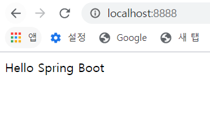
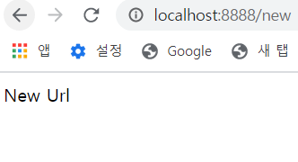

## 1. 20.03.30 First Window
스프링 부트가 어떻게 쉽게 쓰이는지 Auto Configuration에 대해 공부하고  
첫 화면을 만들어 보았습니다.  
 
## 2. 20.03.31 Controller
MVC모델을 따라 Controller와 View를 만들었습니다.  
RestController를 사용하면 정보를 받아서 사용하는 작업을 쉽게 진행할 수 있었습니다.
  
* Controller입니다. /home을 RequestMapping해서 사용했습니다.
  
* 레스트 컨트롤러입니다. GET을 이용하여 값을 받아와 사용합니다.  

* view를 이용하여 title과 출력을 지정해준 모습입니다.